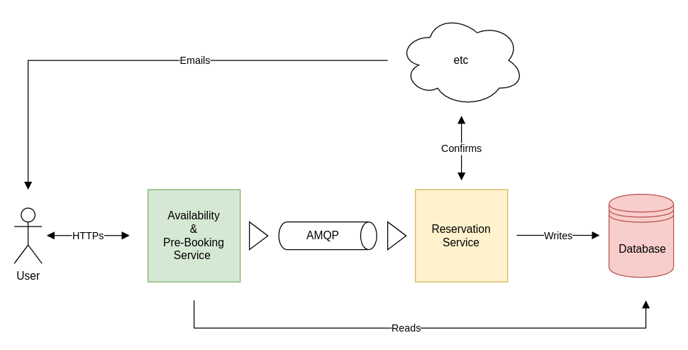
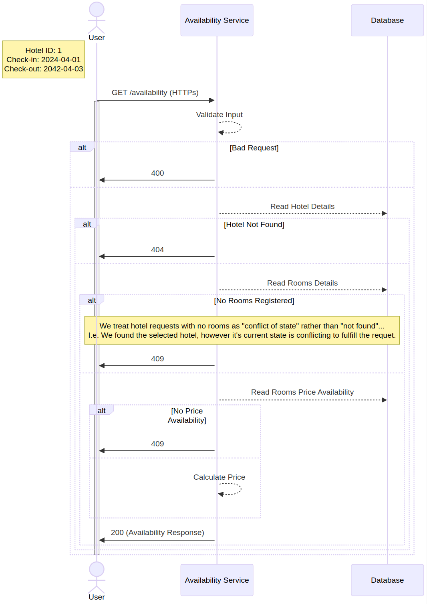

# Modern Reactive Spring Backend (Kt)

[](https://github.com/u-ways/modern-reactive-spring-backend-kotlin/actions/workflows/CICD.yml)
[](https://codeclimate.com/github/u-ways/modern-reactive-spring-backend-kotlin)
[](https://github.com/u-ways/modern-reactive-spring-backend-kotlin/blob/master/LICENSE)
[](https://awesome.re)

- [Background](#background)
- [Katanox API](#katanox-api)
- [Vert.x vs Spring WebFlux](#vertx-vs-spring-webflux)
  * [The Streams Specification Vs The Reactive Manifesto](#the-streams-specification-vs-the-reactive-manifesto)
  * [Personal Verdict](#personal-verdict)
- [Implementation Details](#implementation-details)
  * [Solution Architecture](#solution-architecture)
  * [Other Practices and Technical Decisions](#other-practices-and-technical-decisions)
  * [Algorithmic Solution](#algorithmic-solution)
- [Usage](#usage)
  * [Prerequisites](#prerequisites)
  * [Running the Application](#running-the-application)
  * [Contributing](#contributing)

## Background

Our older monolithic applications were built using an older generation of Spring Boot with vertical scaling architecture. 
With the rise of cloud computing and the need for more scalable and resilient applications, we've moved towards a more 
modern, reactive architecture. Our framework of choice was [Vert.x](https://vertx.io/), which allowed us to build reactive microservices 
that could scale horizontally with ease.

Vert.x reactive model was a great experience and a great fit for our use case, it became our de-facto standard for building
new services. However, this made us neglect the Spring Boot ecosystem, which has been evolving rapidly and is becoming
a strong contender in the reactive space.

This project is a software's engineer take at building a modern reactive API using Spring Boot and Kotlin. The goal is 
to leverage as much as possible from the Spring Boot ecosystem and compare it to our current experience with Vert.x.

## Katanox API

I have chosen [Katanox API](https://docs.katanox.com/reference) as the base for this project mainly because their API
is well-documented and provides a good use case for building a reactive API.

> Katanox is a direct booking API that allows Buyers and Suppliers to establish a partnership effortlessly in a B2B 
> marketplace. We aim to open hotel sales to the next generation of travel sellers ranging from airlines to travel 
> publishers, voice assistants to messaging apps.
> 
> - Katanox is not a Channel Manager - it connects with different PMSs without the need to map rooms for new partners.
> - Katanox is not a GDS - direct deals are easily managed through a new technology that keeps your content updated.
> - Katanox is not an OTA - it is not even a channel. It is a platform where you have control over your partnerships.
> 
> We want to drive innovation for Buyers and Suppliers and ultimately help the growth of the travel industry.

- Source: [Katanox - What is Katanox?](https://support.katanox.com/en/articles/5485057-what-is-katanox)

Check them out, they have a great API and a great team behind it.

## Vert.x vs Spring WebFlux

You might be interested in a technical comparison between Vert.x and Project Reactor.
Here are some relevant (albeit some are old) resources that can help you with your research:

- [**Reactive Architectures**](https://blog.rcode3.com/blog/vertx-vs-webflux/): Comparing Vert.x to Spring WebFlux.
- [**Reactive Microservices with Spring**](https://www.youtube.com/watch?v=1F10gr2pbvQ): Conference talk on building reactive microservices with Spring.
- [**Reactive Microservices with Vert.x**](https://www.youtube.com/watch?v=7IbdWcdlYOI): Conference talk on building reactive microservices with Vert.x.
- [**SpringBoot Webflux vs Vert.x**](https://blog.rcode3.com/blog/vertx-vs-webflux/): Performance comparison for hello world case.
- [**vertx-vs-spring-reactor**](https://github.com/ankushs92/vertx-vs-spring-reactor?tab=readme-ov-file): A benchmark comparing using Vertx vs Spring Reactor.

### The Streams Specification Vs The Reactive Manifesto

Both Vert.x and [Project Reactor](https://projectreactor.io/) (What Spring WebFlux is based on) are based on the [Reactive Streams Specification](https://github.com/reactive-streams/reactive-streams-jvm?tab=readme-ov-file#reactive-streams),
which in turn came about as a result of the [Reactive Manifesto](https://www.reactivemanifesto.org/). However, it's important
to distinguish between the after mentioned specification and manifesto, for that, have a look at the AWS Whitepaper on
[Reactive programming and reactive streams](https://docs.aws.amazon.com/whitepapers/latest/reactive-systems-on-aws/characteristics-of-reactive-systems.html).

### Personal Verdict

Although the SpringBoot ecosystem is extremely rich and well-supported, I found reactive Spring implementation locks you
into a specific set of types (e.g. returning an instance of `Mono<T>` or `Flux<T>` so it can be subscribed to at the end). 
As a result, you are unable to leverage the full power of the Spring ecosystem. However, I found Project Reactor a joy to 
work with as it's functional programming model and the reactive streams API are well-thought-out.

In contrast, Vert.x is much more minimalistic than Spring, and it's [architecture model](https://vertx.io/docs/vertx-core/java/#event_bus), with careful engineering,
can be abstracted away from the developer. This allows the developer to focus on the business logic and not on the framework,
resulting in a more straightforward and cleaner codebase. However, the ecosystem is not as rich as Spring, and you might
find yourself building custom libraries to handle the complexity of your services.

For example, one of my favourite features of Vert.x is the [Verticle](https://vertx.io/docs/vertx-core/java/#_verticles) model, which allows you to build your services
in a more modular way. Allowing your team members to work in multiple parts of the application without causing conflicts.

Although, it's worth mentioning we have gone through a lot of Vert.x iterations to get the complexity right to reduce our 
TTM (Time to Market) via our own in-house Vert.x framework that is used for building new services. This involved trial 
and error, and we had to build a lot of custom solutions to handle the complexity of our services. So I am sure we can 
achieve the same with reactive Spring Boot with a bit more effort.

## Implementation Details

### Solution Architecture



For this project, I decided to go for a READ-ONLY microservice that will provide the availability of properties and the
ability to book a room. The "pre-booking" service will simulate an asynchronous flow via a `RabbitMQ` message broker, and
the "reservation service" will confirm and save the booking details to the database.

Of course, this is a simplified version of the architecture, in a real-world scenario, we would have more services and
complex provisioning logic involved in the booking process. However, for the sake of this project, I decided to keep it 
simple.

It's also worth mentioning the "Availability & Pre-Booking Service" shouldn't be communicating with the Database directly,
as it would complicate data synchronisation with the "Reservation Service". Instead, it would be better to have a repository
service that would handle the database operations. This would allow us to have a more decoupled architecture and a more
scalable solution via an intermediary API layer which would mediate database operations. However, I wanted to use the 
R2DBC in this POC, and so I've overlooked this architectural decision.

### Other Practices and Technical Decisions

I have decided to follow DDD (Domain-Driven Design) principles for this project, and drive the implementation via ATDD
(Acceptance Test-Driven Development). So the acceptance tests are the driving force behind the implementation features.

On top of that, jOOQ will be used to generate the database schema and the queries, and Flyway will be used to manage the
database migrations. This will allow us to have a [database-first approach](https://www.jooq.org/#a=usp-database-first) 
to the implementation and a typesafe database object referencing.

Metrics scraping will be done via Micrometer and Prometheus, and the logs (in-production) will be sent as JSON to a
centralised logging system (e.g. [ELK stack](https://aws.amazon.com/what-is/elk-stack/)). Readiness and Liveness probes 
will be implemented via Spring Boot Actuator to allow Kubernetes to manage the lifecycle of the application.

I will also admit I did not have the time to do a 100% test coverage so many of the sad-path scenarios are not covered,
likewise the happy-path scenarios are not fully covered. However, I have tried to cover the most important scenarios.

### Algorithmic Solution

Bulk of the work was done in the availability service, where we calculate the availability of a given hotel ID rooms
based on the check-in and check-out dates. The algorithm is quite simple, we have to check if the room is available for
the given dates, and if it is, we have to calculate the price based on set of associated prices (Details can be found
in the [AvailabilityService](./src/main/kotlin/com/katanox/api/domain/availability/AvailabilityService.kt) kdoc).



The implementation is driven via the [AvailabilityEndpointIT](./src/test/kotlin/com/katanox/api/acceptance/AvailabilityEndpointIT.kt) acceptance tests.

Likewise, the booking service implementation is driven via the [BookingEndpointIT](./src/test/kotlin/com/katanox/api/acceptance/BookingEndpointIT.kt) acceptance tests. In which it 
relies on the availability service to check if the requested room is "really" available for the given dates. Therefore,
we enabled a caching layer to reduce the number of calls to the availability repository. You can see the implementation 
details in the [BookingService](./src/main/kotlin/com/katanox/api/domain/booking/BookingService.kt) class.

This is by no means a perfect solution, and there are many ways to improve it, but the reactive programming patterns 
via Project-Reactor are well-illustrated in the implementation.

## Usage

### Prerequisites

- You should have [Gradle](https://gradle.org/install/) installed to build the application.
- You also need [Docker](https://docs.docker.com/get-docker/) installed to deploy the application and accompanying infrastructure.

### Running the Application

We use [Makefile](./Makefile) to simplify the build and run process.

Simply run:

```bash
make deploy-app
```

and everything will be set and ran for you. You can also use `make undeploy-app` to gracefully stop the 
application and tear down the containers. For checking the health status of the application you can run:

```bash
curl -sv http://localhost:8080/actuator/health | jq
```

Actuator discovery is turned on, so accessing [http://localhost:8080/actuator](http://localhost:8080/actuator) will 
give you a list of available actuator endpoints to probe. (e.g. flyway, metrics, health, etc.)

**TIP**: check out the [./local](./local) directory for handy SQL inserts and open HTTP requests files.

### Contributing

Although this is more of an educational/research project, I am open to contributions. If you have any suggestions or
improvements, feel free to open a PR or an issue.

I am a big fan of providing a great Developer Experience (DX), so I've allocated time in making the build 
process as seamless as possible. When you try generating jOOQ classes, you will trigger the appropriate Gradle
task to generate the classes without manual intervention. Task input/output caching is also configured.

Integration tests are ran via testcontainers, and they're gracefully stopped after the tests are done via Ryuk.

Also, a JVM toolchain is provided to ensure the correct version (21) of Java is being used.

I advise checking out the [build.gradle.kts](./build.gradle.kts) and the [Makefile](./Makefile) to understand the
build process and what's available to you.

___

